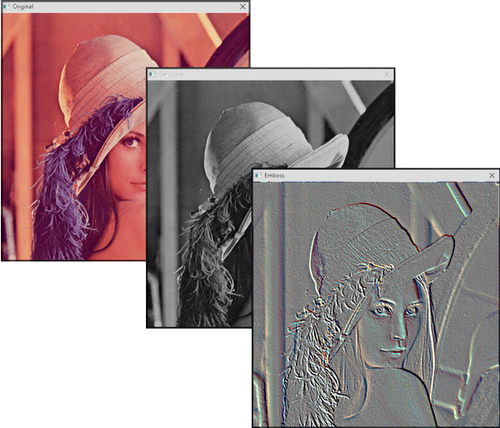

# ImageFilter
Crée par G-Rom, ImageFilter se présente sous la forme d'une DLL (ImageFilter.dll) et un include (ImageFilter.pbi) pour le traitement d'images avec le langage PureBasic. 

- GreyScale
- Luminosity
- Contrast
- Gamma
- Seuil 
- Inverse (Négatif d'une image)
- Normal Map
- Filtre Sharpen
- Filtre Motion Blur
- Filtre Emboss
- Filtre Find Edges 
- Filtre Blur
- Filtre Gaussian

# Lien
http://lodev.org/cgtutor/filtering.html

